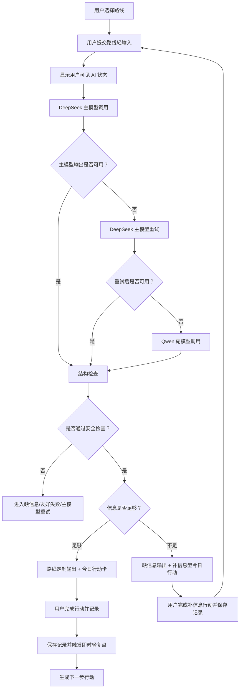

# MVP AI 工作流与安全边界设计

> 本文档基于《21天总准则》《新MVP PRD》《MVP PM决策共识》《MVP UX准则》《MVP 页面线框与关键状态设计》和《MVP 四路线输入输出数据设计》整理。
> 当前文档只定义第一版 MVP 的 AI 工作流、模型调用策略、输出安全边界、失败处理和用户可见状态，不进入代码实现、接口实现或具体 prompt 编写。

## 1. 设计目标

第一版 AI 工作流只服务：

```text
行动 -> 记录 -> 复盘 -> 调整
```

AI 不是自由问答助手，不是职业测评师，不是招聘方，不是裁判，也不是自动投递工具。

AI 在第一版中的职责是：

- 围绕用户已选择的路线完成具体转化。
- 判断信息是否足够。
- 信息足够时生成路线定制输出。
- 信息不足时生成补信息型今日行动。
- 把输出收束为 1 个今日行动。
- 基于真实记录做即时轻复盘。
- 生成下一步行动。

AI 不负责：

- 给用户做完整职业定位。
- 生成完整求职报告。
- 生成完整简历。
- 承诺 offer、面试、薪资、录取概率或通过率。
- 判断用户本人适合或不适合某职业或岗位。
- 编造经历、JD、数据、项目结果、投递反馈、证书、奖项或职责。

## 2. 模型调用策略

### 2.1 主副模型规则

第一版模型策略：

- DeepSeek 为主模型。
- Qwen 为副模型。
- 正常情况下只调用 DeepSeek。
- 只有当 DeepSeek 主模型重试后仍失败时，才调用 Qwen 副模型。
- 不因路线不同默认切换模型。
- 不因用户输入不足默认切换模型。
- 不因主模型输出不符合产品边界而直接调用副模型。

副模型只解决主模型重试失败后的可用性问题，不改变产品判断、UX 结构和安全边界。

### 2.2 主模型重试规则

当 DeepSeek 首次调用失败或输出不可用时，可以进行主模型重试。

可以重试的情况：

- 请求超时。
- 响应为空。
- 响应结构明显不完整。
- 响应无法解析为预期结果。
- 输出没有生成今日行动。
- 输出未能区分信息足够和缺信息状态。

不应通过直接放宽产品边界来“修复”输出。

例如，不能因为主模型没生成可用结果，就允许它输出：

- 匹配度百分比。
- 录取概率。
- 编造的 JD 要求。
- 泛泛鼓励。
- 完整但没有依据的报告。

### 2.3 副模型调用规则

只有当 DeepSeek 主模型重试后仍失败，才调用 Qwen。

这里的“失败”只指模型服务或机器可处理结果不可用，例如：

- 请求失败。
- 请求超时。
- 响应为空。
- 响应无法解析。
- 输出缺少必要结构，无法进入后续结构检查。

以下情况不应直接触发 Qwen：

- 用户输入不足。
- 主模型输出违反安全边界。
- 主模型输出内容不够好但仍可进入结构检查。
- 主模型输出让产品侧不满意。
- 主模型输出需要用户补充事实。

Qwen 调用后仍必须遵守：

- 同一条路线输入输出结构。
- 同一套缺信息标准。
- 同一套安全边界。
- 同一套用户可见 AI 状态。
- 同一套隐私规则。
- 同一份用户原始输入。
- 同一套输出 schema。
- 同一套结构检查和安全检查。
- 同一套“不编造、不下定论、不做报告”的产品边界。

副模型输出不得因为是兜底而降低质量标准。

Qwen 接手时，只承担“在主模型不可用时完成同一任务”的角色，不承担重新解释产品策略、放宽输出边界或生成替代报告的角色。

如果 Qwen 输出仍不可用，应进入友好失败或缺信息状态，而不是生成基础版报告。

### 2.3.1 副模型质量保证规则

为了避免副模型接手后输出质量下降，Qwen 必须接受和 DeepSeek 等价的输入约束：

- 路线不变：不得把当前路线改写成另一条路线。
- 输入不变：不得补充用户没有提供的新事实。
- 目标不变：仍然只生成路线定制输出、缺信息行动或轻复盘，不生成完整报告。
- 结构不变：必须返回同一套字段结构。
- 检查不变：必须通过同一套结构检查、安全检查和今日行动检查。
- 用户体验不变：用户不得知道内部发生了主副模型切换。

副模型通过检查后，才可以把结果返回给用户。

副模型没有通过检查时，产品应继续保护用户体验：

- 如果是信息不足，进入缺信息状态。
- 如果是结构或安全问题，进入友好失败状态。
- 不展示内部失败原因。
- 不生成基础版报告。

第一版 MVP 暂不设置“基础版报告兜底”。模型不可用时，系统最多提供保存草稿、补真实信息或稍后继续的行动，不提供看似完整但依据不足的报告。

硬约束：

```text
AI 输出质量不合格，不等于进入基础版报告兜底。
模型服务不可用，也不生成基础版报告。
第一版 MVP 没有基础版报告兜底。
```

### 2.4 用户不可见规则

以下内容不得出现在终端用户界面、toast、弹窗、错误页、加载状态、复制内容或导出内容中：

- DeepSeek。
- Qwen。
- 主模型。
- 副模型。
- 重试。
- 兜底。
- fallback。
- prompt。
- token。
- API key。
- 模型调用失败。
- 请求头。
- 服务端日志。
- 错误堆栈。
- 接口名。
- 内部路由名。
- 字段契约。

用户只能看到产品化状态，例如：

```text
正在阅读你提供的信息。
正在检查还缺哪些真实信息。
正在生成今天先做的一步。
```

## 3. AI 工作流总览



## 4. AI 调用场景

第一版主要有四类 AI 调用。

| 场景 | 触发时机 | AI 目标 | 用户可见状态 |
|---|---|---|---|
| 路线首次输出 | 用户提交路线轻输入后 | 判断信息是否足够，生成路线输出或补信息行动 | 正在阅读你提供的信息 / 正在生成今天先做的一步 |
| 缺信息判断 | 路线输入不足时 | 说明不能判断什么、已知道什么、今天先补什么 | 正在检查还缺哪些真实信息 |
| 即时轻复盘 | 用户保存路线定制记录后 | 基于真实记录生成复盘和下一步行动 | 正在整理复盘依据 / 正在从记录中找线索 |
| 7 天轻复盘 | 用户积累一定记录后 | 总结过去 7 天真实推进和下一轮行动 | 正在整理过去 7 天的推进记录 |

首页加载历史记录、用户填写表单、自动保存草稿不需要制造 AI 正在工作的感觉。

## 5. 路线级 AI 职责

### 5.1 方向 -> 岗位样本

AI 第一次调用：

- 根据用户背景提出可搜索方向和搜索关键词。
- 帮用户缩小到可搜索、有初级入口的岗位方向。
- 判断是否缺少背景、经历、兴趣或约束。
- 生成今日行动：给出搜索关键词，让用户自己保存 1-3 个真实岗位样本。

AI 第二次调用：

- 基于用户带回来的真实 JD 做轻复盘。
- 判断哪些方向值得继续验证。
- 给出下一步补信息或验证行动。

禁止：

- 说“最适合你的职业”。
- 说“强烈推荐你做某职业”。
- 做职业测评式结论。
- 把兴趣直接等同于职业方向。

### 5.2 经历 -> 简历材料

AI 第一次调用：

- 从用户原始经历中提取已明确事实。
- 标出缺失事实。
- 标出不能夸大的部分。
- 信息足够时生成克制简历片段初稿。
- 信息不足时生成补事实行动。

AI 第二次调用：

- 轻复盘这段材料是否真实、克制、可被事实支撑。
- 判断是否适合进入下一步 JD 对照。

禁止：

- 把“参与”写成“主导”。
- 把“协助”写成“负责”。
- 编造数据、成果、职责或影响范围。
- 自动把未确认片段写入正式记录。

### 5.3 JD -> 投递前最小修改

AI 第一次调用：

- 提取真实 JD 中最关键的 3-5 个要求。
- 对照用户材料，指出当前能支撑的部分。
- 指出当前材料里还看不出来的部分。
- 给出 1-2 条投递前最小修改动作。
- 生成今日行动。

AI 第二次调用：

- 记录本次投递准备、材料版本和待观察反馈。
- 为后续无反馈复盘提供依据。

禁止：

- 输出匹配度百分比。
- 输出录取概率。
- 给出绝对“能投”或“不能投”。
- 判断用户本人适合或不适合。
- 没有真实 JD 时做深度支撑判断。

### 5.4 投递记录 -> 轻复盘

AI 第一次调用：

- 判断当前投递记录是否足够支撑复盘。
- 记录不足时生成补记录今日行动。
- 记录足够时提炼可疑线索和信息缺口。

AI 第二次调用：

- 基于真实投递记录做轻复盘。
- 形成下一轮 1-3 个岗位样本验证动作或材料调整动作。

禁止：

- 断言没反馈的真实原因。
- 把无反馈归因为用户本人不行。
- 编造公司反馈、筛选规则或岗位要求。
- 鼓励盲目海投。

## 6. 信息足够与缺信息判断

缺信息不是失败状态，而是第一版 MVP 的正常状态。

核心原则：

```text
缺信息不等于不能生成今日行动；
缺信息只是不能生成无依据的深度判断或完整结论。
```

### 6.1 判断顺序

AI 应按以下顺序判断：

1. 用户选择的是哪条路线。
2. 这条路线最终要完成什么转化。
3. 当前输入是否足够支撑该转化。
4. 如果不足，缺的是用户没填、还是用户确实没有。
5. 是否可以生成补信息型今日行动。

### 6.2 用户没填，但可能有

例如：

- 用户有项目经历，但还没写。
- 用户有 JD，但还没复制。
- 用户有投递记录，但还没整理。
- 用户有简历片段，但还没贴。

AI 应降低输入阻力：

- 只要求先填一条。
- 给示例。
- 允许写“不确定”。
- 允许写“暂时没有”。

### 6.3 用户确实没有

例如：

- 没有真实项目结果。
- 没有投递记录。
- 没有目标 JD。
- 没有岗位样本。
- 没有明确方向。

AI 不应逼用户编，也不应空泛鼓励。

应生成补信息来源或求职样本的行动：

- 没有 JD：今天先找 1 个真实 JD。
- 没有项目结果：今天先查找是否有交付物、截图、课程作业或老师反馈。
- 没有投递记录：今天先补 1 条最低字段投递记录。
- 没有岗位方向：今天先保存 1 个看得懂的岗位样本。

### 6.4 缺信息输出结构

缺信息时，AI 输出至少包含：

1. 现在还不能可靠判断什么。
2. 目前已经知道什么。
3. 今天先补什么。

不允许：

- 生成看似完整但没有依据的报告。
- 编造 JD、经历、数据、结果或反馈。
- 用泛泛建议填满页面。
- 把“当前材料看不出来”说成“用户能力不够”。
- 直接进入录取概率、匹配度、适合度等判断。

## 7. 今日行动生成规则

今日行动必须是强约束单行动。

AI 每次只生成 1 个优先动作，不给 3-5 个并列任务。

### 7.1 伸展区原则

今日行动应落在用户伸展区：

- 15-30 分钟内可完成。
- 有真实推进。
- 需要用户做一个具体动作。
- 做完能留下记录。
- 不要求一次完成大任务。

不应生成舒适区行动：

- 想一想职业方向。
- 泛泛看看岗位。
- 阅读一些求职建议。

不应生成困难区行动：

- 今天重写完整简历。
- 今天投递 20 个岗位。
- 今天完成职业定位。
- 今天整理全部经历。

### 7.2 今日行动卡结构

AI 输出的今日行动卡必须包含：

| 字段 | 说明 |
|---|---|
| 今天只做什么 | 1 个动作 |
| 为什么先做这一步 | 与当前卡点的关系 |
| 具体怎么做 | 简短步骤 |
| 预计需要多久 | 优先 15-30 分钟 |
| 做完后记录什么 | 对应路线记录对象 |

## 8. 输出安全检查

AI 输出进入页面前，必须通过安全检查。

### 8.1 通用禁止项

所有路线都禁止：

- 承诺 offer、面试、录取概率、薪资结果或通过率。
- 输出匹配度百分比。
- 判断用户本人适合或不适合某职业或岗位。
- 编造经历、JD、数据、项目结果、投递反馈、证书、奖项或职责。
- 把“材料看不出来”说成“用户能力不行”。
- 提供违法、歧视、伪造材料、虚假包装或误导性求职建议。
- 信息不足时假装完成深度分析。
- 用空泛鼓励替代具体行动。
- 鼓励盲目海投。

### 8.2 路线定制禁止项

| 路线 | 额外禁止 |
|---|---|
| 方向 -> 岗位样本 | 最适合职业、强烈推荐、职业测评式结论 |
| 经历 -> 简历材料 | 把参与写成主导、把协助写成负责、编造成果 |
| JD -> 投递前最小修改 | 匹配度、录取概率、绝对能投/不能投、适合度 |
| 投递记录 -> 轻复盘 | 失败归因定论、公司筛选规则猜测、编造反馈 |

### 8.3 安全检查失败处理

如果输出违反安全边界：

1. 优先让主模型按同一路线和同一输入重试。
2. 如果是信息不足导致的风险，进入缺信息状态。
3. 如果仍无法生成可靠输出，进入友好失败状态。

不允许把违规内容展示给用户。

## 9. 用户确认规则

AI 生成内容不能默认成为用户事实。

必须用户确认后才保存为正式记录：

- 简历片段版本。
- 修改后材料片段。
- JD 对照修改记录中的修改内容。
- 投递记录中的材料版本。

推荐用户可见表达：

```text
如果这段表达符合真实情况，可以保存；如果没有做过，不要保留。
```

禁止：

- AI 自动把未确认内容写入用户正式材料。
- AI 自动把建议当作用户已经完成的事实。
- AI 把推测内容写进记录对象。

## 10. 用户可见 AI 状态

凡是页面步骤需要调用 AI，应显示用户可理解的实时 AI 状态。

| 场景 | 推荐表达 |
|---|---|
| 路线轻输入提交后 | 正在阅读你提供的信息 / 正在生成今天先做的一步 |
| 缺信息判断 | 正在检查还缺哪些真实信息 |
| 保存记录并复盘 | 正在整理复盘依据 / 正在从记录中找线索 |
| 7 天轻复盘 | 正在整理过去 7 天的推进记录 |

AI 状态只能解释“正在做什么”，不能制造神秘感、炫技感或权威感。

第一版默认状态阈值：

- 0-8 秒：显示页面内 AI 状态。
- 超过 8 秒：显示长等待状态，并提示内容已保存。
- 超过 30 秒仍无结果：进入友好失败状态，并保留草稿。

长等待状态推荐补充：

```text
你可以先离开，当前内容已保存，下次回来会从这里继续。
```

不需要显示 AI 状态：

- 首页加载历史记录。
- 用户填写表单时。
- 自动保存草稿时。

自动保存草稿只显示：

```text
已保存草稿。
```

## 11. 失败处理

### 11.1 内部失败类型

内部可以区分：

- 主模型调用失败。
- 主模型重试失败。
- 副模型调用失败。
- 输出结构不完整。
- 输出违反安全边界。
- 网络异常。
- 配置异常。
- 保存失败。

但这些内部失败类型不得直接展示给用户。

### 11.2 用户可见失败表达

推荐表达：

```text
这次暂时没整理出来。你可以先保存当前填写内容，稍后继续。
```

或：

```text
当前内容已经保存。稍后可以从这里继续。
```

如果记录已保存但复盘失败：

```text
你的记录已经保存，可以稍后继续复盘。
```

如果保存失败，应与 AI 整理失败分开表达：

```text
这次没有保存成功，请先不要关闭页面，稍后再试。
```

禁止表达：

```text
API key 无效。
模型调用失败。
接口报错。
服务器返回 500。
DeepSeek 请求失败，切换 Qwen。
```

## 12. 隐私与内部信息边界

终端用户界面不得显示任何代码、密钥、配置、日志或内部实现信息。

禁止显示：

- API key。
- 环境变量。
- 请求头。
- 服务端日志。
- 错误堆栈。
- 代码片段。
- 数据库连接信息。
- 模型配置。
- prompt 原文。
- token 信息。
- 调试信息。
- 内部路由名、接口名或字段契约。
- 开发者、主人或系统侧的私密信息。

用户提供的信息也属于隐私信息：

- 真实经历。
- JD 原文。
- 投递记录。
- 反馈记录。
- 简历片段。
- 用户怀疑的问题。

这些信息不得用于：

- 公共样例。
- 其他用户可见内容。
- 营销文案。
- 调试输出。
- 错误页。

除非用户主动在当前页面查看、编辑、复制或保存，否则不应在无关页面暴露用户完整原文。

## 13. 复制与导出边界

第一版可以支持轻量复制。

可以复制：

- 克制简历片段。
- 今日行动。
- 轻复盘中的下一步行动。
- 用户自己保存的岗位要求摘要。

不做：

- 完整报告导出。
- 一键生成完整简历。
- 投递记录批量导出。
- 带内部字段、模型状态或调试信息的复制内容。

复制内容不得包含：

- 代码。
- API key。
- prompt。
- token。
- 模型名。
- 内部路由。
- 接口名。
- 调试信息。

## 14. 文档后续衔接

本文档确认后，建议继续产出：

1. 测试用例与私测观察标准。
2. 页面低保真线框图。
3. 上线检查清单。
