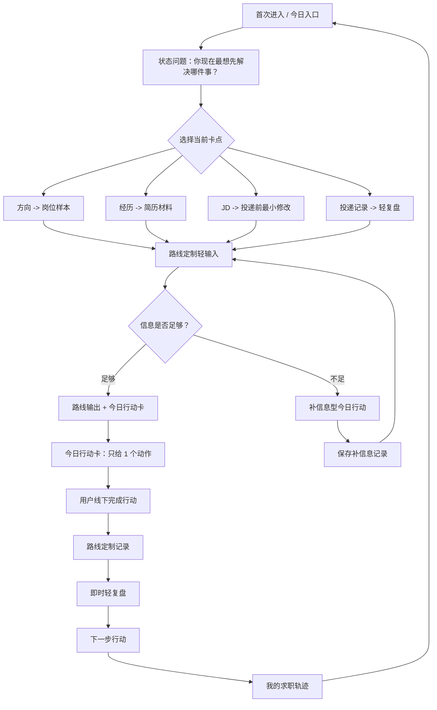
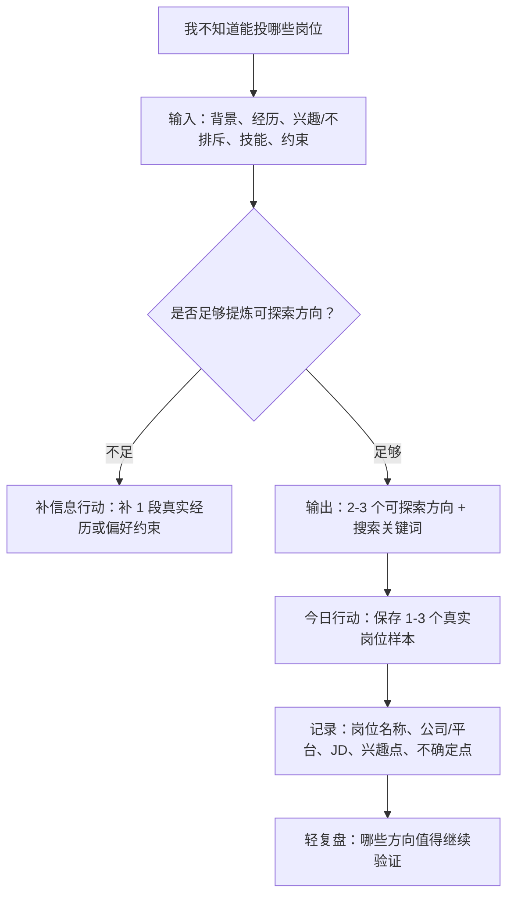
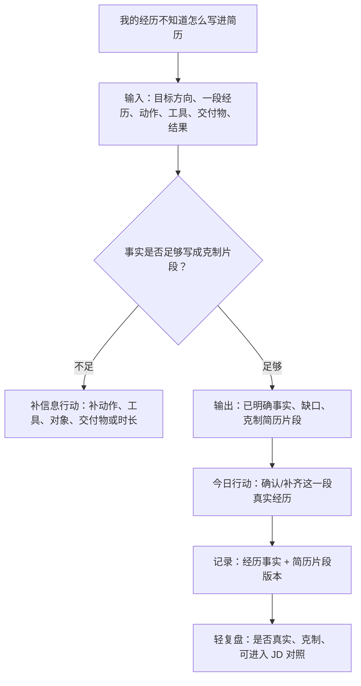
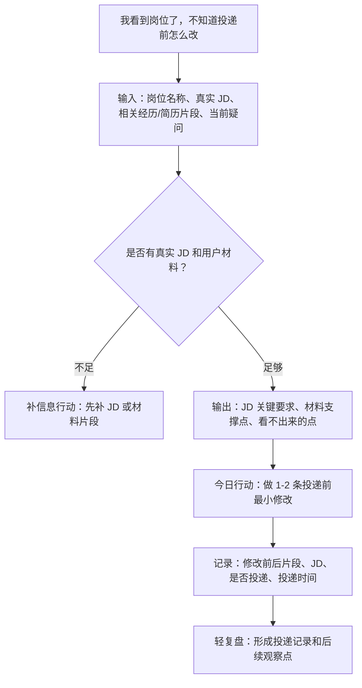
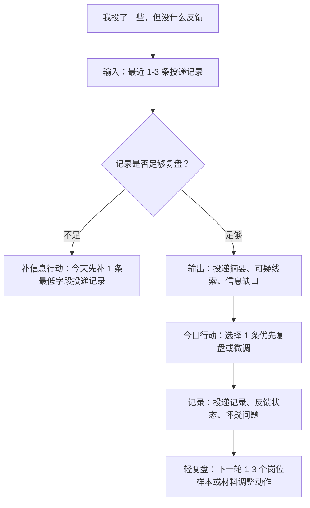
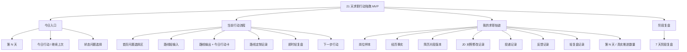

# MVP UX 信息架构第一版

> 本文档基于《21天总准则》《新MVP PRD》《项目协作准则》《MVP PM决策共识》整理。
> 当前阶段只定义 UX / 信息架构，不进入代码实现。

## 1. 设计结论

第一版 MVP 采用“一个主流程 + 四条路线分支 + 一个轻量求职轨迹入口”的信息架构。

核心判断：

- 第一版不是四个 AI 小工具集合。
- 首页不直接呈现四个并列工具入口。
- 四条路线是状态问题后的行动路径，不是彼此独立的产品模块。
- 每次使用都必须落到一个今日行动、一个真实记录或一次轻复盘。
- 今日行动卡是第一版 MVP 的核心对象。

第一版主流程应始终服务：

```text
行动 -> 记录 -> 复盘 -> 调整
```

## 2. 整体用户流程图



## 3. 四条路线流程图

### 3.1 方向 -> 岗位样本

对应用户问题：我不知道能投哪些岗位。

路线目标不是推荐职业，而是帮助用户找到 1-3 个真实岗位样本。



首版今日行动方向：

```text
今天先保存 1-3 个真实岗位样本。
```

### 3.2 经历 -> 简历材料

对应用户问题：我的经历不知道怎么写进简历。

路线目标不是生成完整简历，而是整理一段真实经历，形成克制、可信、可用于简历的片段。



首版今日行动方向：

```text
今天先整理一段真实经历。
```

### 3.3 JD -> 投递前最小修改

对应用户问题：我看到岗位了，不知道投递前怎么改。

路线目标不是输出匹配度，而是判断当前材料和真实 JD 的支撑关系，并给出投递前最小修改动作。



首版今日行动方向：

```text
今天先对照 JD 做 1-2 条投递前最小修改。
```

### 3.4 投递记录 -> 轻复盘

对应用户问题：我投了一些，但没什么反馈。

路线目标不是归因失败，而是从模糊的“投了没反馈”转成可复盘的投递记录和下一轮验证动作。



首版今日行动方向：

```text
今天先补 1 条最低字段投递记录；如果已经有 2-3 条，再选择 1 条先复盘。
```

## 4. 页面清单

| 页面 | 解决的问题 | 关键内容 |
|---|---|---|
| 今日入口 / 首页 | 用户今天从哪里开始 | 第 N 天、今日行动、上次记录、状态问题入口 |
| 首页问题选择区 | 用户当前卡在哪里 | 嵌在首页内的 4 个问题型选择；不是独立主页面，不做工具感入口 |
| 路线轻输入页 | 收集足够真实信息 | 分块输入、示例、可写“不确定”、不编造提醒 |
| 缺信息行动页 | 信息不足时也能推进 | 还不能判断什么、已知道什么、为什么只补这一项、今天先补什么 |
| 路线输出 + 今日行动卡页 | 用户今天只做一件事 | 路线输出只解释为什么先做这一步；主对象是今日行动卡 |
| 路线定制记录页 | 留下可复盘证据 | 按路线保存岗位样本、经历事实、修改记录或投递记录 |
| 即时轻复盘页 | 基于记录给下一步 | 复盘依据、看到的线索、信息缺口、下一步行动 |
| 我的求职轨迹页 | 让用户看到自己推进过 | 已保存岗位、经历片段、材料版本、投递、反馈、复盘 |
| 7 天阶段复盘页 | 看一小轮是否成立 | 过去 7 天行动、记录、线索、下一轮重点 |

第一版不单独设置“状态选择页”“路线输出页”“今日行动卡页”或“21 天进度页”作为主页面：

- 首页问题选择区默认嵌在首页；只有用户点击“换一个当前问题”时作为首页内状态出现。
- 路线输出与今日行动卡合并在同一页；路线输出不是报告页，只服务于今日行动。
- 21 天周期感合并进“我的求职轨迹”的轻量头部，不新增进度中心、课程表或打卡页。

## 5. 信息架构



## 6. 首页结构原则

首页只回答一个核心问题：

```text
今天先从哪件事开始？
```

首页首屏建议保留 PM 已确认主文案：

```text
不用一次想清楚，今天先推进一件事。
```

承接问题：

```text
你现在最想先解决哪件事？
```

四个问题型选择：

- 我不知道能投哪些岗位。
- 我的经历不知道怎么写进简历。
- 我看到岗位了，不知道投递前怎么改。
- 我投了一些，但没什么反馈。

首页可以轻量显示“21 天陪跑 · 第 N 天”，但主信息必须是今日行动，而不是课程进度。

首页四选一必须被表达为“当前卡点选择”，而不是功能选择。四个入口上方建议固定提示：

```text
先选你今天最卡的一件事，后面只会给一个小行动。
```

## 7. 缺信息状态

缺信息状态不是失败状态，而是第一版 MVP 的正常状态。

当信息不足时，不生成看似完整但没有依据的报告，而是进入补信息型今日行动。

缺信息页至少包含：

1. 现在还不能可靠判断什么。
2. 目前已经知道什么。
3. 为什么只需要先补这一项。
4. 今天先补什么。

缺信息行动完成后的闭环必须是：

```text
完成补信息行动
-> 保存补信息记录
-> 重新判断信息是否足够
-> 信息足够：生成路线输出 + 今日行动卡
-> 信息仍不足：继续给 1 个补信息行动
```

缺信息行动不能默认直接进入完整复盘。只有当用户完成的是可复盘的真实行动，并且已有足够记录支撑时，才进入即时轻复盘。

示例：

```text
现在还不能可靠判断这份 JD 和你的材料支撑关系，因为还缺真实 JD。
目前能看出你已经有一个目标岗位名称。
今天先补这份岗位的真实 JD 或 3-5 条岗位要求。
```

## 8. 记录原则

第一版不做统一的大记录中心，也不做完整求职 CRM。

记录入口、记录字段和记录时机按路线定制。用户感知应是：

```text
我做完这一步，顺手留下以后能复盘的东西。
```

记录对象只保存三类内容：

- 用户真实提供的岗位、经历、JD、投递和反馈。
- AI 基于真实证据生成的简历片段、修改建议和轻复盘结论。
- 下一次继续推进时必须知道的信息。

## 9. 轻复盘结构

第一版轻复盘不做完整报告，也不能薄到像随口建议。

固定结构为：

1. 复盘依据：本次复盘基于哪些真实记录。
2. 看到的线索：从记录中提炼 1-3 个具体线索。
3. 信息缺口：当前还缺哪些真实信息。
4. 下一步行动：只给 1 个优先动作。

第一版优先保证即时轻复盘成立。回访轻复盘和 7 天阶段复盘作为连续体验继续细化。

## 10. AI 调用约束

本节只记录后续 AI 工作流设计需要遵守的产品约束，不作为用户可见页面信息。

第一版 AI 调用模型策略：

- DeepSeek 为主模型。
- Qwen 为副模型。
- 正常情况下只调用 DeepSeek。
- 只有当 DeepSeek 主模型重试后仍失败时，才调用 Qwen 副模型。
- 不因路线不同默认切换模型。
- 不把模型名称、重试、兜底等内部机制暴露给终端用户。

这条约束不改变 UX 主流程，但会影响后续 AI 工作流、异常状态和测试用例设计。

## 11. 第一版不做

第一版不做：

- 通用自由问 AI 入口。
- 四个并列 AI 工具入口。
- 完整求职 CRM。
- 完整简历编辑器。
- 招聘平台或岗位数据库。
- 自动抓取 JD。
- 自动投递。
- 职业测评。
- 课程表、知识库或内容社区。
- 账号、支付、多用户后台、企业端、学校后台或家长端。

## 12. 后续衔接

本文档确认后，建议后续继续产出：

1. 四路线输入输出数据设计。
2. AI 工作流与安全边界设计。
3. 页面线框与关键状态设计。
4. 测试用例与私测观察标准。
5. 上线检查清单。
