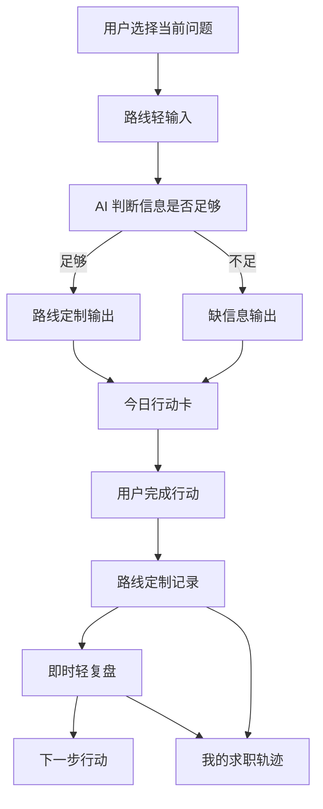
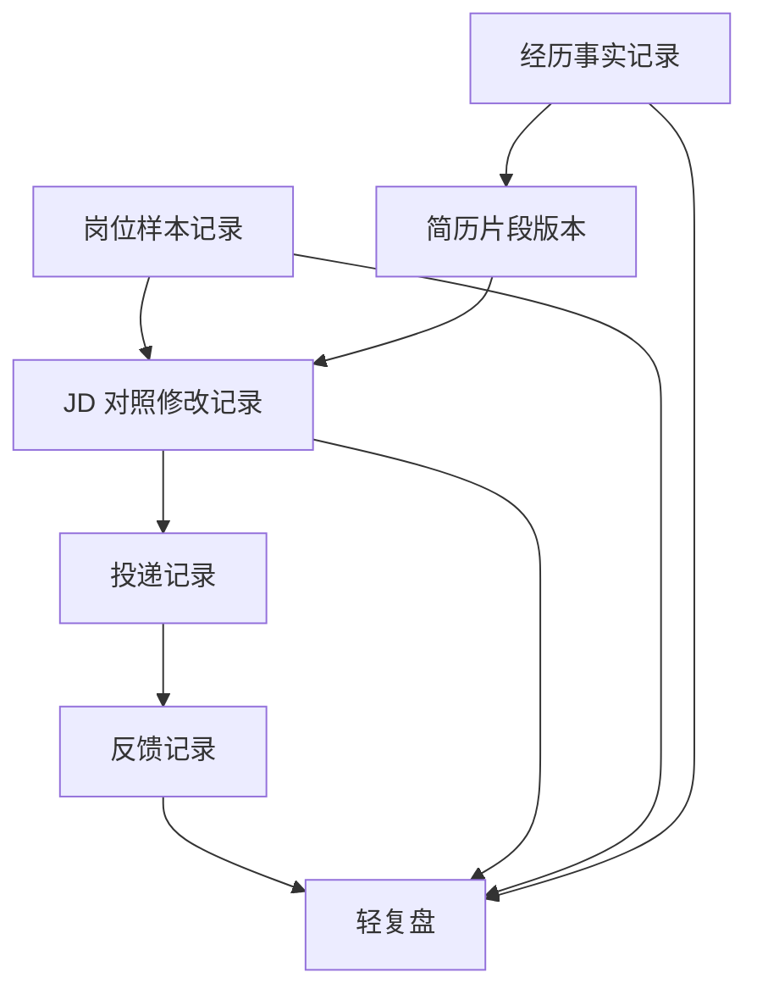

# MVP 四路线输入输出数据设计

> 本文档基于《21天总准则》《新MVP PRD》《MVP PM决策共识》《MVP UX信息架构第一版》《MVP UX准则》和《MVP 页面线框与关键状态设计》整理。
> 当前文档只定义第一版 MVP 的输入、输出、缺信息状态、页面展示和记录对象，不进入代码实现、接口设计或数据库实现。

## 1. 设计目标

第一版输入输出数据设计只服务两个目标：

```text
生成今日行动
形成可复盘记录
```

它不是为了：

- 建立完整用户画像。
- 生成完整求职报告。
- 做完整简历编辑器。
- 做完整投递 CRM。
- 做招聘平台或岗位数据库。
- 做职业测评。

所有字段、输出块和记录对象都必须能回答：

- 它是否帮助用户知道今天做什么？
- 它是否基于用户真实材料或真实岗位信息？
- 它是否能留下后续轻复盘依据？
- 它是否避免编造、夸大和绝对判断？

如果不能，就不应进入第一版。

## 2. 总体数据流



用户可见的是轻问答和行动卡，底层沉淀为结构化记录。

## 3. 通用字段与状态

### 3.1 通用上下文

每次路线会话建议保留以下上下文，供后续 AI 工作流和测试设计参考：

| 字段 | 说明 | 用户是否可见 |
|---|---|---|
| route_key | 当前路线标识 | 否 |
| route_label | 用户选择的问题型路线名称 | 是 |
| day_index | 21 天陪跑第 N 天 | 是 |
| session_started_at | 本次路线开始时间 | 否 |
| source_records | 本次使用到的历史记录 | 部分可见 |
| draft_saved | 是否已有草稿 | 可见为“已保存草稿” |
| ai_processing_state | 用户可理解的 AI 处理状态 | 是 |

禁止将内部路由名、接口名、模型名、prompt、token、错误堆栈、API key 或调试信息展示给用户。

### 3.2 通用 AI 输出结构

所有路线输出都应收束到：

| 输出块 | 作用 |
|---|---|
| short_assessment | 一句短判断：现在能看出什么 / 还缺什么 |
| route_result | 路线定制结果，不同路线结构不同 |
| missing_info | 当前还缺哪些真实信息 |
| today_action | 今日行动卡，只给 1 个优先动作 |
| record_prompt | 做完后记录什么 |
| safety_notes | 内部安全检查结果，不直接展示为技术信息 |

### 3.3 通用今日行动字段

| 字段 | 说明 |
|---|---|
| action_title | 今天只做什么 |
| action_reason | 为什么先做这一步 |
| action_steps | 具体怎么做，保持短 |
| estimated_time | 预计时间，优先 15-30 分钟 |
| record_after_done | 做完后要记录什么 |
| action_type | 岗位样本 / 经历事实 / JD 修改 / 投递记录 / 补信息 |

今日行动必须落在伸展区：比什么都不做多一步，但不要求用户一次完成大任务。

### 3.4 通用缺信息输出结构

当信息不足时，不生成完整报告，而是生成补信息型今日行动。

| 输出块 | 说明 |
|---|---|
| cannot_judge | 现在还不能可靠判断什么 |
| already_known | 目前已经知道什么 |
| missing_fields | 还缺哪些真实信息 |
| fill_action | 今天先补什么，只给 1 个动作 |
| continue_after_fill | 补齐后可以继续做什么 |

缺信息状态下仍然必须给今日行动，但不能做无依据深度判断。

### 3.5 今日行动实例

今日行动卡展示的是用户可见内容；为了支撑首页回访、未完成继续、保存后稍后回来和轨迹页，第一版需要保留最小行动实例。

| 字段 | 说明 | 用户是否可见 |
|---|---|---|
| action_id | 行动实例 ID | 否 |
| route_key | 来源路线 | 部分可见为路线名称 |
| action_title | 今天只做什么 | 是 |
| action_status | 行动状态：draft / active / completed / saved_for_later / replaced | 部分可见 |
| created_at | 创建时间 | 部分可见 |
| completed_at | 完成时间 | 部分可见 |
| linked_record_id | 完成后关联的记录 | 否 |
| next_action_source | 下一步行动来源：AI 输出 / 轻复盘 / 用户手动保存 | 否 |

行动状态用户可见表达必须普通：

- draft：已保存草稿。
- active：今天先做这一步。
- completed：已留下记录。
- saved_for_later：已保存，稍后继续。
- replaced：已换成新的当前行动。

### 3.6 轻复盘记录

即时轻复盘、回访轻复盘和 7 天轻复盘都复用同一类最小记录对象。

| 字段 | 说明 | 用户是否可见 |
|---|---|---|
| review_id | 轻复盘记录 ID | 否 |
| based_on_record_ids | 本次复盘基于哪些真实记录 | 部分可见 |
| route_key | 来源路线 | 部分可见 |
| review_basis | 复盘依据 | 是 |
| clues | 看到的 1-3 个线索 | 是 |
| missing_info | 仍然缺的信息 | 是 |
| next_action | 下一步 1 个优先行动 | 是 |
| created_at | 创建时间 | 部分可见 |
| ai_generated | 是否由 AI 整理 | 否 |
| user_saved | 用户是否确认保存 | 部分可见 |

AI 整理出的轻复盘必须基于真实记录。未经用户确认保存的轻复盘，不应作为用户已经完成的事实进入轨迹页。

## 4. 路线一：方向 -> 岗位样本

### 4.1 路线目标

用户问题：

```text
我不知道能投哪些岗位。
```

路线目标：

```text
从用户背景和真实经历中，找到 1-3 个可继续验证的真实岗位样本。
```

不是推荐职业，不是职业测评。

### 4.2 用户输入

#### 最小输入

| 字段 | 用户可见问题 | 是否必需 | 允许“不确定” |
|---|---|---|---|
| education_background | 你的专业或学习背景是什么？ | 是 | 是 |
| real_experiences | 你做过哪些课程、项目、社团、兼职或实习？ | 是 | 是 |
| interests_or_acceptables | 你感兴趣或不排斥哪些事情？ | 是 | 是 |
| constraints | 有哪些暂时不想接受的工作条件？ | 是 | 是 |

#### 可选补充

| 字段 | 说明 |
|---|---|
| skills_tools | 会用的工具或技能 |
| city_preference | 城市偏好 |
| industry_preference | 行业偏好 |
| tried_directions | 已经想过或试过的方向 |

### 4.3 信息足够标准

至少能看出：

- 用户的学习背景或经历来源。
- 至少 1 段真实经历或可参考材料。
- 至少 1 个兴趣、偏好、限制或不排斥方向。

如果只有“我不知道做什么”，没有任何背景或经历，不应给职业方向结论。

### 4.4 缺信息状态

常见缺口：

- 没有专业或学习背景。
- 没有任何真实经历。
- 没有兴趣、偏好或约束。
- 只有“想赚钱”“不知道”这类泛泛描述。

补信息型今日行动示例：

```text
今天先写下 1 段你真实做过的课程、项目、社团、兼职或实习经历。不用完整，先写发生过什么和你做了什么。
```

### 4.5 AI 输出

| 输出块 | 内容 |
|---|---|
| 可探索方向 | 2-3 个，只能说“可以先探索” |
| 搜索关键词 | 每个方向 3-5 个可搜索岗位关键词 |
| 用户已有依据 | 来自用户真实背景或经历的依据 |
| 风险或缺口 | 当前还需要验证什么 |
| 今日行动 | 保存 1-3 个真实岗位样本 |

禁止输出：

- 最适合你的职业。
- 强烈推荐你做某职业。
- 职业定位已确定。
- 性格测评式结论。

### 4.6 页面展示

推荐展示顺序：

```text
可以先探索的方向
-> 为什么可以先看这些
-> 还需要验证什么
-> 今日行动卡
```

页面主角仍是今日行动卡，不是方向分析。

### 4.7 记录对象：岗位样本记录

用户完成行动后保存：

| 字段 | 说明 |
|---|---|
| job_title | 岗位名称 |
| company_or_platform | 公司或平台 |
| jd_text_or_summary | JD 原文或岗位要求摘要 |
| interest_point | 自己感兴趣的点 |
| concern_point | 自己担心或不确定的点 |
| saved_at | 保存时间 |

不保存：

- 岗位推荐排序。
- 薪资统计。
- 公司画像。
- 自动抓取来源。

## 5. 路线二：经历 -> 简历材料

### 5.1 路线目标

用户问题：

```text
我的经历不知道怎么写进简历。
```

路线目标：

```text
整理一段真实经历，形成克制、可信、可用于简历的片段。
```

不是完整简历生成器。

### 5.2 用户输入

#### 最小输入

| 字段 | 用户可见问题 | 是否必需 | 允许“不确定” |
|---|---|---|---|
| target_direction | 你大概想投什么方向？ | 是 | 是 |
| raw_experience | 先写一段相关真实经历。 | 是 | 否，可写很短 |
| actual_actions | 这段经历里你实际做过哪些动作？ | 是 | 是 |
| deliverable_or_result | 有交付物或结果吗？没有可以写“无明确结果”。 | 是 | 是 |

#### 可选补充

| 字段 | 说明 |
|---|---|
| tools_used | 使用过的工具 |
| time_period | 发生时间或持续多久 |
| audience_or_target | 面向对象 |
| team_role | 团队角色 |
| proof_links | 可查记录或作品链接 |

### 5.3 信息足够标准

至少能看出：

- 这是一段真实经历。
- 用户实际做过的动作。
- 是否有交付物、对象、工具、时长或结果中的一部分。

如果只有“我参加过一个项目”，但看不出实际动作，不应生成完整简历片段。

### 5.4 缺信息状态

常见缺口：

- 缺实际动作。
- 缺工具、对象或交付物。
- 缺用户在团队里的真实角色。
- 缺结果，且没有说明“无明确结果”。

补信息型今日行动示例：

```text
今天先补这段经历里你实际做过的 3 个动作。如果没有明确结果，可以直接写“无明确结果”。
```

### 5.5 AI 输出

| 输出块 | 内容 |
|---|---|
| 已明确事实 | 用户材料中已经能确认的事实 |
| 缺失事实 | 当前还看不出来的信息 |
| 不应夸大的部分 | 参与、协助、结果、职责等边界 |
| 克制简历片段 | 信息足够时生成，必须基于事实 |
| 今日行动 | 补事实，或确认/修改并保存片段 |

禁止输出：

- 编造数据或成果。
- 把参与写成主导。
- 把协助写成负责。
- 这样一定能过筛。

### 5.6 页面展示

推荐展示顺序：

```text
已经能确认的事实
-> 还缺哪些事实
-> 克制简历片段或补事实行动
-> 今日行动卡
```

AI 生成的简历片段必须让用户确认后才能保存为正式记录。

### 5.7 记录对象

#### 经历事实记录

| 字段 | 说明 |
|---|---|
| experience_title | 经历名称或一句话描述 |
| time_period | 发生时间或持续多久 |
| actual_actions | 实际做过的动作 |
| tools_used | 使用过的工具 |
| audience_or_target | 面向对象 |
| deliverable | 交付物 |
| result | 结果；没有可写“无明确结果” |
| missing_facts | 还缺哪些事实 |

#### 简历片段版本

| 字段 | 说明 |
|---|---|
| source_experience_id | 对应的经历事实记录 |
| resume_snippet | 片段正文 |
| supporting_facts | 支撑这段表达的事实 |
| still_missing | 仍需补充的事实 |
| user_confirmed | 用户是否确认 |
| created_or_updated_at | 生成或修改时间 |

未确认的 AI 片段不得进入正式求职轨迹。

## 6. 路线三：JD -> 投递前最小修改

### 6.1 路线目标

用户问题：

```text
我看到岗位了，不知道投递前怎么改。
```

路线目标：

```text
基于真实 JD 和用户材料，判断材料与 JD 的支撑关系，并给出投递前最小修改动作。
```

不是匹配度评分，不判断用户本人适不适合。

### 6.2 用户输入

#### 最小输入

| 字段 | 用户可见问题 | 是否必需 | 允许“不确定” |
|---|---|---|---|
| target_job_title | 目标岗位名称是什么？ | 是 | 否 |
| jd_text_or_requirements | 贴上真实 JD 或 3-5 条岗位要求。 | 是 | 否 |
| user_material | 贴上你准备使用的相关经历或简历片段。 | 是 | 是 |
| current_question | 你现在最不确定什么？ | 否 | 是 |

#### 可选补充

| 字段 | 说明 |
|---|---|
| company_or_platform | 公司或平台 |
| resume_version | 当前使用的材料版本 |
| planned_submit_time | 计划什么时候投递 |

### 6.3 信息足够标准

必须同时有：

- 真实 JD 或岗位要求摘要。
- 用户相关材料或简历片段。

如果只有岗位名称，不做深度支撑判断。

### 6.4 缺信息状态

常见缺口：

- 只有岗位名称，没有真实 JD。
- 有 JD，但没有用户材料。
- 材料太泛，看不出真实经历。

补信息型今日行动示例：

```text
今天先补这份岗位的真实 JD，或贴出其中 3-5 条你看得懂的岗位要求。
```

### 6.5 AI 输出

| 输出块 | 内容 |
|---|---|
| JD 关键要求 | 3-5 条来自真实 JD 的要求 |
| 当前材料能支撑什么 | 只基于用户材料 |
| 当前材料看不出来什么 | 缺口，不说成能力不足 |
| 投递前最小修改 | 1-2 条，必须基于真实材料 |
| 投递后记录什么 | 材料版本、投递时间、反馈状态 |
| 今日行动 | 做 1-2 条最小修改，或补 1 条真实事实 |

禁止输出：

- 匹配度百分比。
- 录取概率。
- 绝对能投或不能投。
- 用户本人适合或不适合。

### 6.6 页面展示

推荐展示顺序：

```text
这个岗位最看重什么
-> 你的材料目前能支撑什么
-> 当前还看不出来什么
-> 投递前最小修改
-> 今日行动卡
```

页面应强调“材料与 JD 的支撑关系”，不评价用户本人。

### 6.7 记录对象：JD 对照修改记录

| 字段 | 说明 |
|---|---|
| target_job_title | 目标岗位名称 |
| jd_text_or_requirements | 真实 JD 或关键要求 |
| material_version | 使用的简历片段版本或用户材料 |
| jd_key_requirements | JD 关键要求 |
| supported_points | 当前材料能支撑的点 |
| unsupported_or_unclear_points | 当前材料看不出来的点 |
| before_snippet | 修改前片段 |
| after_snippet | 修改后片段 |
| minimal_changes | 本次 1-2 条最小修改动作 |
| submitted | 是否投递 |
| submitted_at | 如果已投递，投递时间 |

修改后片段必须由用户确认后保存。

## 7. 路线四：投递记录 -> 轻复盘

### 7.1 路线目标

用户问题：

```text
我投了一些，但没什么反馈。
```

路线目标：

```text
从模糊的“投了没反馈”，转成可复盘的投递记录和下一轮验证动作。
```

不是失败归因，不鼓励海投。

### 7.2 用户输入

#### 最小输入

最低可先补 1 条投递记录；若要进入完整轻复盘，优先需要 2-3 条投递记录。每条包括：

| 字段 | 用户可见问题 | 是否必需 | 允许“不确定” |
|---|---|---|---|
| job_title | 岗位名称 | 是 | 否 |
| company_or_platform | 公司或平台 | 是 | 是 |
| submitted_at | 投递时间 | 是 | 是 |
| jd_summary | 岗位要求摘要 | 是 | 是 |
| material_version | 使用的材料版本 | 是 | 是 |
| feedback_status | 当前反馈状态 | 是 | 是 |
| user_suspicion | 你自己怀疑的问题是什么？ | 否 | 是 |

反馈状态首版可包括：

- 暂无反馈。
- 已查看。
- 收到测评或笔试。
- 收到面试。
- 被拒。
- 其他。

### 7.3 信息足够标准

最低 1 条投递记录可以成立为补记录行动；进入完整轻复盘时，优先需要至少 2 条投递记录。

每条记录至少能看出：

- 投了什么岗位。
- 投给哪个公司或平台。
- 大概什么时候投。
- 用了什么材料。
- 目前反馈状态。

如果只说“投了很多没反馈”，不做复盘。

### 7.4 缺信息状态

常见缺口：

- 没有具体岗位名称。
- 没有投递时间。
- 没有材料版本。
- 没有 JD 摘要。
- 只有情绪描述，没有记录。

补信息型今日行动示例：

```text
今天先补 1 条最低字段投递记录：岗位名称、公司或平台、投递时间和当前反馈状态。如果已经有 2-3 条，再补材料版本和怀疑点，并选择 1 条先复盘。
```

### 7.5 AI 输出

| 输出块 | 内容 |
|---|---|
| 复盘依据 | 基于哪些真实投递记录 |
| 记录是否足够 | 是否能支撑轻复盘 |
| 可疑线索 | 1-3 个，只能说可能线索 |
| 信息缺口 | 还缺哪些投递或 JD 信息 |
| 下一轮验证动作 | 1 个优先动作，可包含 1-3 个岗位小样本方向 |
| 今日行动 | 补记录、选择 1 条复盘或做材料微调 |

禁止输出：

- 断言没反馈的真实原因。
- 把无反馈归因为用户本人不行。
- 编造公司反馈、筛选规则或岗位要求。
- 鼓励盲目海投。

### 7.6 页面展示

推荐展示顺序：

```text
本次复盘依据
-> 记录是否足够
-> 能看到的线索
-> 信息缺口
-> 下一步行动
```

如果记录不足，直接进入补记录行动页。

### 7.7 记录对象

#### 投递记录

| 字段 | 说明 |
|---|---|
| job_title | 岗位名称 |
| company_or_platform | 公司或平台 |
| submitted_at | 投递时间 |
| channel | 投递渠道 |
| material_version | 使用的材料版本 |
| jd_summary | JD 摘要 |
| feedback_status | 当前反馈状态 |
| user_suspicion | 用户自己的怀疑点 |

#### 反馈记录

| 字段 | 说明 |
|---|---|
| application_record_id | 对应投递记录 |
| feedback_type | 反馈类型 |
| feedback_at | 反馈时间 |
| feedback_summary | 反馈内容摘要 |
| user_question | 用户自己的疑问 |
| next_action | 下一步动作 |

不保存招聘方原因推断为事实。

## 8. 记录对象关系



这些对象共同支撑：

```text
行动 -> 记录 -> 复盘 -> 调整
```

## 9. 用户确认与隐私边界

### 9.1 用户确认

AI 生成内容不能默认成为用户事实。

必须用户确认后才保存为正式记录的内容：

- 简历片段版本。
- 修改后材料片段。
- JD 对照修改记录中的修改内容。
- 投递记录中的材料版本。

推荐提示：

```text
如果这段表达符合真实情况，可以保存；如果没有做过，不要保留。
```

### 9.2 隐私边界

用户输入和记录中的以下内容都属于隐私信息：

- 真实经历。
- JD 原文。
- 投递记录。
- 反馈记录。
- 简历片段。
- 用户怀疑的问题。

不得用于：

- 公共样例。
- 其他用户可见内容。
- 营销文案。
- 调试输出。
- 错误页。

用户可复制内容不得包含代码、API key、prompt、token、模型名、接口名、内部路由或调试信息。

## 10. AI 状态与失败状态

需要调用 AI 的步骤显示用户可理解的状态：

| 场景 | 推荐状态 |
|---|---|
| 路线轻输入提交后 | 正在阅读你提供的信息 / 正在生成今天先做的一步 |
| 缺信息判断 | 正在检查还缺哪些真实信息 |
| 保存记录并复盘 | 正在整理复盘依据 / 正在从记录中找线索 |
| 7 天轻复盘 | 正在整理过去 7 天的推进记录 |

禁止显示：

- DeepSeek。
- Qwen。
- 主模型或副模型。
- 重试。
- 兜底。
- fallback。
- prompt。
- token。
- API key。
- 模型调用失败。

失败状态推荐表达：

```text
这次暂时没整理出来。你可以先保存当前填写内容，稍后继续。
```

或：

```text
当前内容已经保存。稍后可以从这里继续。
```

## 11. 第一版不进入的数据范围

第一版不设计：

- 完整账号资料。
- 完整用户画像。
- 职业测评结果。
- 岗位数据库。
- 公司画像。
- 薪资统计。
- 自动抓取 JD 结果。
- 自动投递结果。
- 完整简历模板。
- 投递漏斗统计。
- 复杂标签系统。
- 付费、订单、企业端或后台管理数据。

## 12. 后续衔接

本文档确认后，建议继续产出：

1. AI 工作流与安全边界设计。
2. 测试用例与私测观察标准。
3. 页面低保真线框图。
