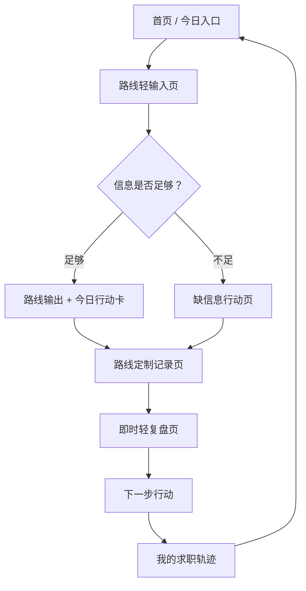

# MVP 页面线框与关键状态设计

> 本文档基于《21天总准则》《新MVP PRD》《MVP PM决策共识》《MVP UX信息架构第一版》和《MVP UX准则》整理。
> 当前文档属于 UX 阶段的低保真页面结构设计，不进入视觉 UI、代码实现或接口设计。

## 1. 设计目标

第一版页面设计只服务一个核心目标：

```text
让用户快速拿到今天能完成的一步，并愿意留下真实记录。
```

页面不追求报告完整、功能丰富或视觉精致，优先保证：

- 用户知道自己在哪一步。
- 用户知道现在要填什么。
- 用户知道为什么要填。
- 用户知道 AI 是否正在处理。
- 用户知道今天只做什么。
- 用户知道做完后怎么记录。
- 用户知道下一次回来从哪里继续。

## 2. 页面总流程



需要调用 AI 的步骤应显示用户可见 AI 状态，但不暴露模型名称、重试或兜底机制。

所有页面都不得显示代码、API key、环境变量、服务端日志、错误堆栈、接口名、模型配置、prompt、token 或任何内部隐私信息。

用户填写的真实经历、JD、投递记录、反馈记录和简历片段也属于用户隐私信息，不得出现在无关页面、公共样例、调试输出或其他用户可见内容中。

## 3. 首页 / 今日入口

### 3.1 页面目标

让用户一进来就知道今天从哪里开始。

首页不是营销页，不是课程表，也不是四个工具入口页。

### 3.2 首次用户页面结构

```text
[轻量进度]
21 天陪跑 · 第 1 天

[主文案]
不用一次想清楚，今天先推进一件事。

[承接问题]
你现在最想先解决哪件事？

[四个问题型选择]
1. 我不知道能投哪些岗位
2. 我的经历不知道怎么写进简历
3. 我看到岗位了，不知道投递前怎么改
4. 我投了一些，但没什么反馈
```

### 3.3 回访用户页面结构

```text
[轻量进度]
21 天陪跑 · 第 N 天

[今日继续]
继续上次推进：整理一段真实经历 / 保存岗位样本 / 补投递记录

[主按钮]
继续今天的行动

[次入口]
换一个问题开始
查看我的求职轨迹
```

### 3.4 页面动作

- 点选任一路线：进入对应路线轻输入页。
- 点“继续今天的行动”：进入上次未完成的行动卡或记录页。
- 点“我的求职轨迹”：进入轨迹页。
- 点“换一个问题开始”：回到问题型选择，但不清空已有草稿和记录。

### 3.5 状态

- 首次无记录：展示四个问题型选择。
- 有未完成行动：优先展示继续行动。
- 有已完成记录：展示最近一次记录和轻复盘入口。

## 4. 路线轻输入页

### 4.1 页面目标

只收集当前路线生成今日行动所需的最少真实信息。

第一版不做大表单，不做通用背景问卷。

### 4.2 通用页面结构

```text
[路线标题]
例如：先看看哪些岗位值得验证

[一句说明]
不用写完整，先写你现在知道的。没有或不确定可以直接写“不确定”。

[2-3 个输入块]
每块一个问题 + 一句示例

[提醒]
如果没有真实经历、数据或结果，不要编。

[主按钮]
生成今天先做的一步
```

### 4.3 需要 AI 状态

用户点击“生成今天先做的一步”后，需要显示 AI 状态。

推荐状态顺序：

```text
正在阅读你提供的信息
-> 正在检查还缺哪些真实信息
-> 正在生成今天先做的一步
```

### 4.4 四路线输入块

#### 方向 -> 岗位样本

```text
你的专业或学习背景是什么？
你做过哪些课程、项目、社团、兼职或实习？
你感兴趣或不排斥哪些事情？有哪些暂时不想接受的条件？
```

#### 经历 -> 简历材料

```text
你大概想投什么方向？
先写一段相关真实经历。
这段经历里你实际做过哪些动作？用过什么工具？有什么交付物？
```

#### JD -> 投递前最小修改

```text
目标岗位名称是什么？
贴上真实 JD 或 3-5 条岗位要求。
贴上你准备使用的相关经历或简历片段。
```

#### 投递记录 -> 轻复盘

```text
先补最近 2-3 条投递记录。
每条记录至少包括：岗位名称、公司或平台、投递时间、岗位要求摘要、使用的材料版本、反馈状态。
你自己最怀疑的问题是什么？
```

## 5. 路线输出 + 今日行动卡

### 5.1 页面目标

把 AI 输出收束成今天能完成的一步。

此页不做分析报告页。

### 5.2 页面结构

```text
[一句短判断]
现在能看出什么 / 当前还缺什么

[今日行动卡]
今天只做什么
为什么先做这一步
具体怎么做
预计需要多久
做完后记录什么

[主按钮]
我做完了，记录结果

[次按钮]
先保存，稍后回来
```

### 5.3 四路线行动卡首版方向

| 路线 | 今日行动 |
|---|---|
| 方向 -> 岗位样本 | 今天先保存 1-3 个真实岗位样本 |
| 经历 -> 简历材料 | 今天先整理一段真实经历 |
| JD -> 投递前最小修改 | 今天先对照 JD 做 1-2 条投递前最小修改 |
| 投递记录 -> 轻复盘 | 今天先补齐最近 2-3 条投递记录，并选择 1 条先复盘 |

### 5.4 状态

- 生成成功：显示短判断和今日行动卡。
- 用户暂不行动：允许保存并回首页。
- 用户完成行动：进入路线定制记录页。
- 用户未完成行动：允许缩小行动，不做失败评价。

未完成行动时推荐表达：

```text
没关系，今天先把这一步缩小一点。
```

可将行动调整为：

- 少保存 1 个岗位样本。
- 先补 1 个事实。
- 先贴 1 份 JD。
- 先记录最近 1-2 条投递。
- 先确认一段材料是否真实。

完成行动并保存记录后，应给轻完成感：

```text
这一步已经留下记录，可以用于下次复盘。
```

不做积分、排行榜、连续打卡压迫或课程完成率。

## 6. 缺信息行动页

### 6.1 页面目标

当信息不足时，不生成虚假完整报告，而是把缺信息变成一个今天能补的小行动。

### 6.2 页面结构

```text
[现在还不能可靠判断什么]
说明暂时不能做哪些深度判断。

[目前已经知道什么]
只基于用户已提供的信息陈述。

[今天先补什么]
只给 1 个补信息行动。

[主按钮]
去补这一项

[次按钮]
先保存，稍后继续
```

### 6.3 需要 AI 状态

如果缺信息状态由 AI 判断产生，生成前需要显示 AI 状态：

```text
正在检查还缺哪些真实信息
```

### 6.4 禁止

- 不说“你填错了”。
- 不要求用户一次补完整所有信息。
- 不生成兜底报告。
- 不展示内部失败原因。

## 7. 路线定制记录页

### 7.1 页面目标

让用户顺手留下以后能复盘的真实记录。

记录页不是统一大中心，也不是 CRM。

### 7.2 通用页面结构

```text
[记录标题]
把刚完成的这一步留下来

[路线定制字段]
只展示本路线需要的最小字段

[提醒]
只记录真实发生的内容，不确定可以写“不确定”。

[主按钮]
保存记录并复盘

[次按钮]
先保存，不复盘

[草稿状态]
已保存草稿
```

### 7.3 四路线记录字段

#### 岗位样本记录

- 岗位名称。
- 公司或平台。
- JD 原文或岗位要求摘要。
- 自己感兴趣的点。
- 自己担心或不确定的点。

#### 经历事实记录

- 经历名称或一句话描述。
- 发生时间或持续多久。
- 实际做过的动作。
- 使用过的工具。
- 面向对象。
- 交付物。
- 结果；没有明确结果可写“无明确结果”。
- 当前版本的简历片段。

#### JD 对照修改记录

- 目标岗位名称。
- 真实 JD 或关键要求。
- 修改前材料片段。
- 修改后材料片段。
- 本次做了哪 1-2 条最小修改。
- 是否已投递。
- 如果已投递，记录投递时间。

#### 投递记录

- 岗位名称。
- 公司或平台。
- 投递时间。
- 投递渠道。
- 使用的材料版本。
- JD 摘要。
- 当前反馈状态。
- 自己怀疑的问题。

### 7.4 需要 AI 状态

用户点击“保存记录并复盘”后，需要显示 AI 状态：

```text
正在整理复盘依据
-> 正在从记录中找线索
-> 正在生成下一步行动
```

### 7.5 AI 生成内容确认状态

AI 生成的简历片段、修改建议、复盘结论和下一步行动，不能默认等同于用户事实。

涉及用户材料表达时，页面应提供确认或修改动作。

推荐结构：

```text
[AI 整理的片段]
...

[提醒]
如果这段表达符合真实情况，可以保存；如果没有做过，不要保留。

[操作]
保存这个版本
继续修改
不保存
```

未确认内容不得进入正式求职轨迹。

## 8. 即时轻复盘页

### 8.1 页面目标

基于刚保存的真实记录，给出下一步。

轻复盘不是完整报告，也不是随口建议。

### 8.2 页面结构

```text
[复盘依据]
本次复盘基于哪些真实记录。

[看到的线索]
从记录里能看到的 1-3 个具体线索。

[信息缺口]
现在还缺哪些真实信息。

[下一步行动]
只给 1 个优先动作。

[主按钮]
把它设为下一次行动

[次按钮]
查看我的求职轨迹
```

### 8.3 状态

- 记录足够：显示 4 块轻复盘。
- 记录不足：转成补信息型下一步行动。
- AI 处理失败：允许保存记录，稍后继续复盘。

用户可见失败表达：

```text
这次暂时没整理出来。你的记录已经保存，可以稍后继续复盘。
```

## 9. 我的求职轨迹页

### 9.1 页面目标

让用户看到自己确实推进过，并能从已有记录继续。

### 9.2 页面结构

```text
[轻量进度]
21 天陪跑 · 第 N 天

[最近推进]
最近一次行动
最近一次记录
最近一次轻复盘

[分类查看]
岗位样本
经历片段
投递记录
反馈记录

[主入口]
继续下一步行动
```

### 9.3 复制边界

第一版可以支持轻量复制。

可以复制：

- 克制简历片段。
- 今日行动。
- 轻复盘中的下一步行动。
- 用户自己保存的岗位要求摘要。

不做完整报告导出、完整简历导出或投递记录批量导出。

复制内容不得包含代码、API key、prompt、token、模型名、内部路由、接口名或调试信息。

### 9.4 边界

不做：

- CRM。
- 数据看板。
- 投递漏斗。
- 多条件筛选。
- 打卡日历。
- 岗位管理系统。

## 10. 7 天轻复盘页

### 10.1 页面目标

当用户积累一定记录后，轻量总结过去 7 天真实推进了什么，并给出下一轮一个优先行动。

### 10.2 页面结构

```text
[过去 7 天你推进了什么]
列出真实行动和记录数量。

[留下了哪些记录]
岗位样本、经历片段、投递记录、反馈记录。

[现在能看到的线索]
1-3 个具体线索。

[下一轮先验证什么]
只给 1 个优先行动。
```

### 10.3 需要 AI 状态

生成 7 天轻复盘时，需要显示 AI 状态：

```text
正在整理过去 7 天的推进记录
-> 正在提炼下一轮可以先验证的事
```

### 10.4 边界

不做：

- 周报式长报告。
- 分数。
- 排名。
- 课程完成率。
- 打卡日历。
- 复杂统计图表。

## 11. 用户可见 AI 状态总表

| 场景 | 是否显示 AI 状态 | 推荐表达 |
|---|---|---|
| 路线轻输入提交后 | 是 | 正在阅读你提供的信息 / 正在生成今天先做的一步 |
| 缺信息判断 | 是 | 正在检查还缺哪些真实信息 |
| 保存记录并复盘 | 是 | 正在整理复盘依据 / 正在从记录中找线索 |
| 7 天轻复盘 | 是 | 正在整理过去 7 天的推进记录 |
| 首页加载历史记录 | 否 | 直接显示最近推进即可 |
| 用户填写表单时 | 否 | 不需要制造 AI 正在工作的感觉 |
| 自动保存草稿 | 否 | 只显示已保存草稿 |

禁止展示：

- DeepSeek。
- Qwen。
- 主模型或副模型。
- 重试。
- 兜底。
- fallback。
- token。
- prompt。
- 模型调用失败。

## 11.1 用户界面隐私与内部信息状态

所有用户可见页面、toast、弹窗、错误页、加载状态和可复制内容都必须遵守隐私与内部信息边界。

禁止展示：

- API key。
- 环境变量。
- 请求头。
- 服务端日志。
- 错误堆栈。
- 代码片段。
- 数据库连接信息。
- 模型配置。
- prompt 原文。
- token 信息。
- 调试信息。
- 内部路由名、接口名或字段契约。
- 开发者、主人或系统侧的私密信息。

用户隐私信息也不得出现在无关页面、公共样例或调试输出中，包括：

- 真实经历。
- JD 原文。
- 投递记录。
- 反馈记录。
- 简历片段。
- 用户怀疑的问题。

内部错误的用户可见表达应产品化。

推荐表达：

```text
这次暂时没整理出来。你可以先保存当前填写内容，稍后继续。
```

```text
当前内容已经保存。稍后可以从这里继续。
```

禁止表达：

```text
API key 无效。
接口报错。
服务器返回 500。
模型调用失败。
DeepSeek 请求失败，切换 Qwen。
```

## 12. 后续衔接

本文档确认后，建议继续产出：

1. 四路线输入输出数据设计。
2. AI 工作流与安全边界设计。
3. 页面低保真线框图。
4. 测试用例与私测观察标准。
